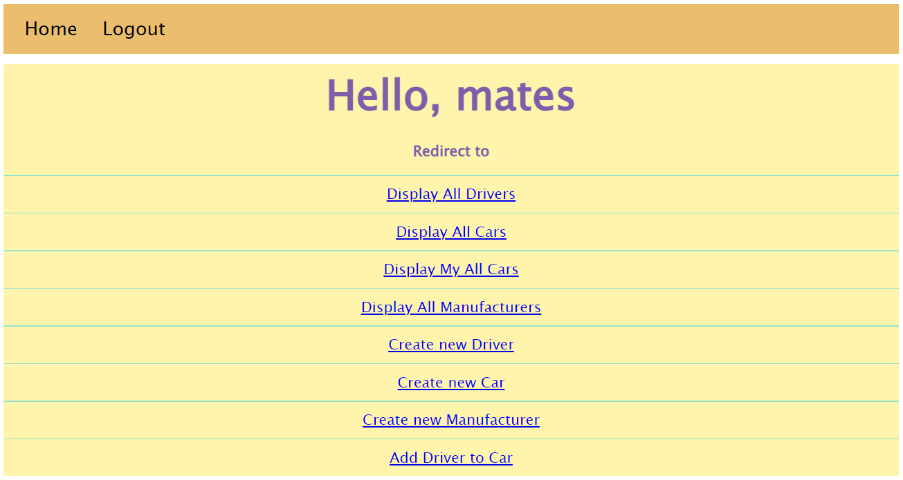
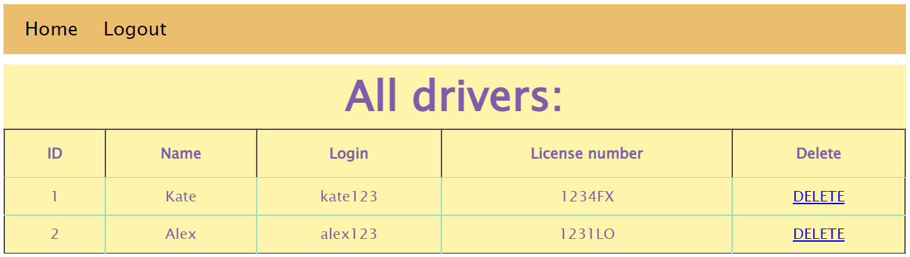

<h1 align="center">
  Taxi Service 🚕
</h1>

  <a href="#-screenshots">Screenshots</a> •
  <a href="#-description">Description</a> •
  <a href="#-features">Features</a> •
  <a href="#-architecture">Architecture</a> •
  <a href="#-technologies">Technologies</a> •
  <a href="#-how-to-start-the-program">How to start the program</a> •
  <a href="#-uml-diagram">UML diagram</a>

## ⭐ Screenshots
### Home screen

### All Drivers screen

## 📃 Description
This is a simple web application for working with a taxi service. It supports authentication, registration and CRUD operations.
The program is written according to SOLID principles, Dependency Injection design pattern and REST rules.

## 🚀 Features
* Display all Drivers / Cars / Manufacturers
* Display all Cars by Driver
* Create new Driver / Car / Manufacturer
* Add Driver to Car
* Soft delete Driver / Car / Manufacturer

## ⚙ Architecture
|       3-layer architecture       |
|:--------------------------------:|
| Controllers (Presentation layer) |
|                ↓↑                |
|   Services (Application layer)   |
|                ↓↑                |
|     DAO (Data access layer)      |

## 🧑‍💻 Technologies
| Technology | Version |
|:-----------|:--------|
| JDK        | 11      |
| Maven      | 4.0.0   |
| Tomcat     | 9.0.50  |
| MySQL      | 8.0.22  |
| JDBC       | -       |
| Servlet    | 4.0.1   |
| JSTL       | 1.2     |
| JSP        | -       |
| HTML, CSS  | -       |

## 📎 How to start the program
1. Clone the project from GitHub
2. Use [`/resources/init_db.sql`](https://github.com/pavlogook/taxi-service/blob/main/src/main/resources/init_db.sql) to create a schema and tables
3. Configure [`/util/ConnectionUtil.java`](https://github.com/pavlogook/taxi-service/blob/main/src/main/java/taxi/util/ConnectionUtil.java#L9) with your own URL, username, password and JDBC driver
4. Configure Tomcat server (it is recommended to use [version 9.0.50](https://archive.apache.org/dist/tomcat/tomcat-9/v9.0.50/bin/))
5. Run and enjoy the program 😉

## ✨ UML diagram

